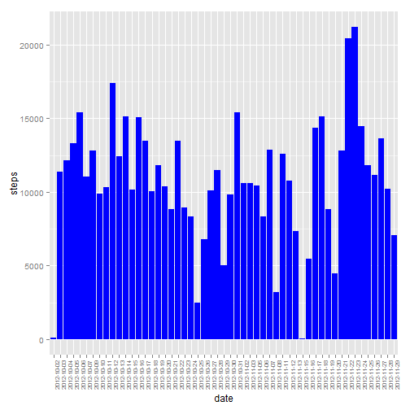
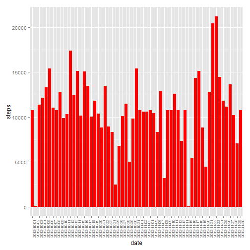
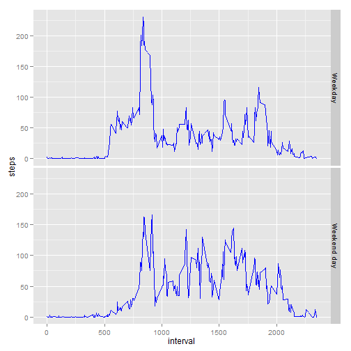

###Reproducible Research - Assignment 1  


**Author: JP Bournas**  
**date: Monday, November 10, 2014**
  
  
This report is covering all the questions included in the first peer assessment in the Reproducible research module.

1. What is the mean total number of steps taken per day?
2. What is the average daily activity pattern?
3. Imputing missing values
4. Are there differences in activity patterns between weekdays and weekends?
  
Each part will be treated individually in this report.  

This data analysis has been produced under R version 3.1.1. The packages ggplot2 is required to run the analysis below.  

The data file used for the subsequent analysis will be automatically downloaded and formatted by running the code below.
This data file can also be downloaded manually via the link provided on the Coursera website.([Activity Data file](https://d396qusza40orc.cloudfront.net/repdata%2Fdata%2Factivity.zip)).  


```r
temp <- tempfile()
download.file("http://d396qusza40orc.cloudfront.net/repdata%2Fdata%2Factivity.zip",temp)
initData <- read.table(unz(temp, "activity.csv"),sep=",",header=TRUE)
unlink(temp)
initData$steps <- as.numeric(initData$steps)
numRow <- nrow(initData)
numCol <- ncol(initData)
colTitle <- paste(colnames(initData))
```

  
This data file contains 17568 rows and 3 columns. The variables included are steps, date, interval.    

  
####1. What is the mean total number of steps taken per day?  
  
The histogram below presents the total number of steps recorded every day during the period analysed.  

```r
library(ggplot2)
dailyStepsSum <- aggregate(steps~date,sum,data=na.omit(initData))
qplot(date,steps,data=dailyStepsSum,geom="histogram",stat='identity',fill= I('blue')) + theme(axis.text.x=element_text(angle = 90, hjust = 0,size=7))   
```

 


```r
stepsMean <- mean(dailyStepsSum$steps)
stepsMean <- format(stepsMean,nsmall = 3,big.mark = ",")
stepsMedian <- median(dailyStepsSum$steps)
stepsMedian <- format(stepsMedian,nsmall = 3,big.mark = ",")
```

From these data we estimate the mean daily number of steps for the observed period as 10,766.189 and the median value as 10,765.000.  

####2. What is the average daily activity pattern?  

The time series below shows the average number of steps taken for all days per interval.  


```r
intAverage <- aggregate(steps~interval,mean,data=na.omit(initData))
qplot(interval,steps,data=intAverage,geom="line",stat='identity',fill= I('blue'))
```

 

```r
intMax <- intAverage[intAverage$steps==max(intAverage$steps),1]
intMaxValue <- intAverage[intAverage$steps==max(intAverage$steps),2]
```


The graph above shows that on average the interval 835 has the highest number of steps taken (206.1698 steps for this interval).  

####3. Imputing missing values


```r
naNum <- sum(is.na(initData$steps))
```


The initial data set contains 2304 NAs.  To reduce the bias caused by these missing values we can create a copy of the initial data set and replace the NAs.  
An analysis of the NAs is showing that they are concentrated over a few days and that none of these days has records that could be used to estimate an average for that specific day. Therefore the best strategy to replace the missing values is certainly to use the average for each interval across all days.


```r
initData2 <- initData
intervalMeanScore <- aggregate(steps~interval,FUN=mean,data = initData2)
colnames(intervalMeanScore) <- c('interval','Mean')
initData2 <- merge(initData2,intervalMeanScore,by.x = 'interval',by.y='interval',all.x=TRUE)
initData2$steps[is.na(initData2$steps)] <- initData2$Mean[is.na(initData2$steps)]
naNum2 <- sum(is.na(initData2))
```

The NA recode strategy allows us to have a data set with 0 NA.  

Now we can re-run the previous analysis with the new data set fully populated. We can now observe the following results.  


```r
dailyStepsSum2 <- aggregate(steps~date,sum,data=initData2)
qplot(date,steps,data=dailyStepsSum2,geom="histogram",stat='identity',fill= I('red')) +   theme(axis.text.x=element_text(angle = 90, hjust = 0,size=7))   
```

 


```r
stepsMean2 <- mean(dailyStepsSum2$steps)
stepsMean2 <- format(stepsMean2,nsmall = 3,big.mark = ",")
stepsMedian2 <- median(dailyStepsSum2$steps)
stepsMedian2 <- format(stepsMedian2,nsmall = 3,big.mark = ",")
```

The impact of the recode strategy applied to NA had a negligible impact on the overall profile of the data. The mean score for the observed period remains at 10,766.189 but the median has been slightly affected and increased to 10,766.189.  


####4. Are there differences in activity patterns between weekdays and weekends?  


The final analysis is looking at splitting the data between weekdays and weekend days in order to observe potential differences in trends over the defined interval.  

```r
initData3 <- initData2
initData3$date <- as.POSIXct(initData3$date)
initData3$day <- weekdays(initData3$date)
wk <- c('Monday','Tuesday','Wednesday','Thursday','Friday')
initData3 <- transform(initData3, weekgrp= ifelse(day %in% wk,"Weekday","Weekend day"))
intDay <- aggregate(steps~interval+weekgrp,mean,data=initData3)
ggplot(intDay, aes(interval,steps)) + geom_line(col='blue') + facet_grid(weekgrp~.)
```

 
